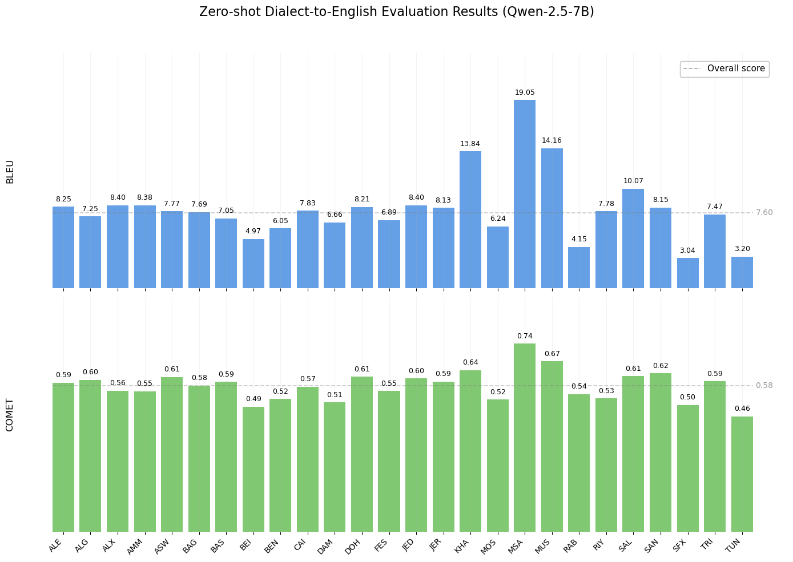
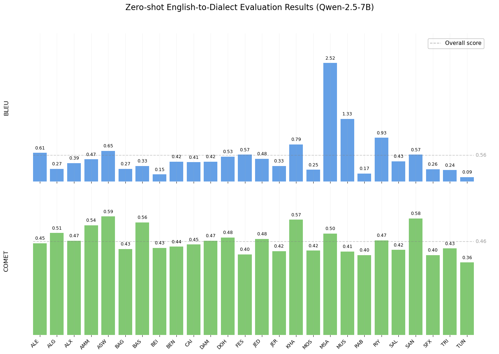
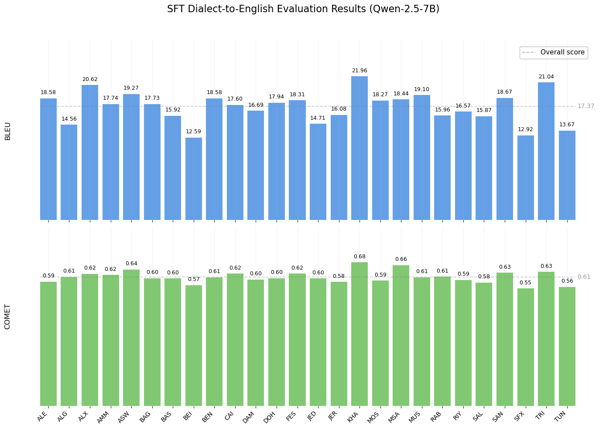
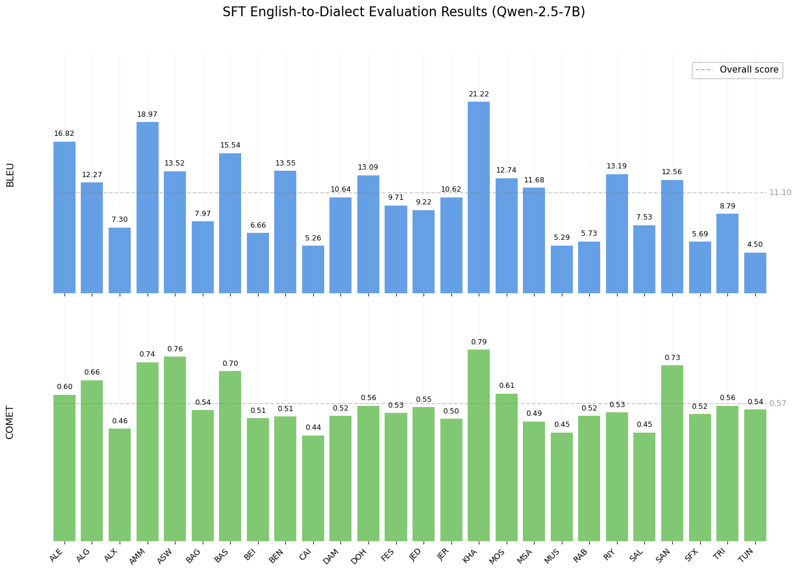
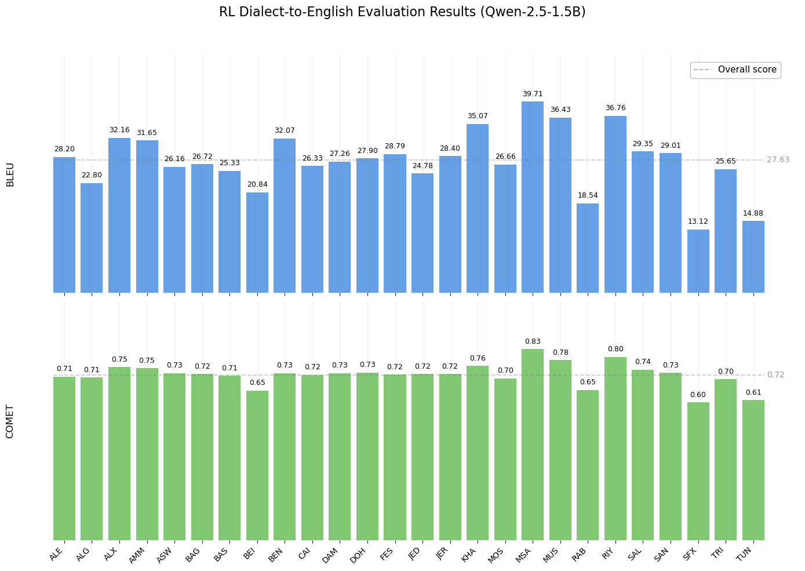
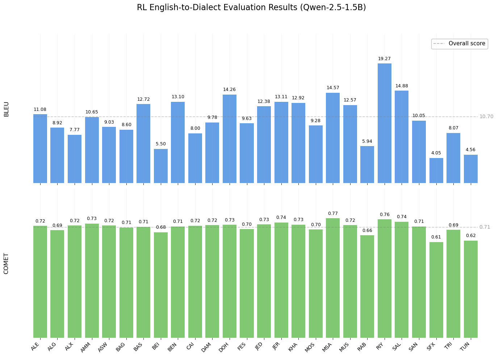
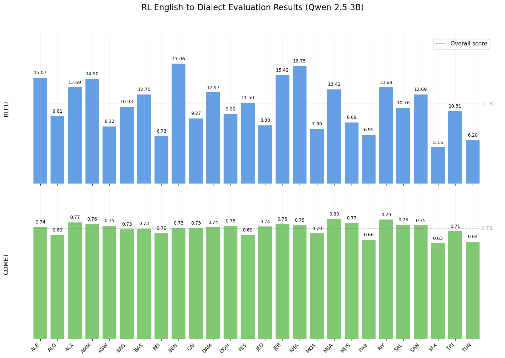
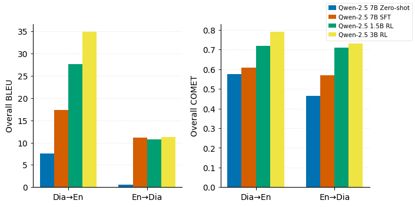

# Arabic Dialect Translation with Small LLMs: Enhancing through Reasoning-Oriented Reinforcement Learning

This repository contains code for training and evaluating Qwen-2.5 models on multidialect Arabic translation tasks. It supports three main approaches: **Pretrained (out-of-the-box) evaluation**, **Supervised Fine-Tuning (SFT)**, and **Reinforcement Learning (RL)** using Group Relative Policy Optimization (GRPO).

## Repository Structure

```
Pretrained/                    # Pretrained evaluation scripts
├── pretrained_bidirectional_all_dialects.py
└── pretrained_bidirectional_all_dialects.sh
SFT/                          # Supervised Fine-Tuning scripts
├── multidialect_sft_dialect_to_en.py
├── multidialect_sft_dialect_to_en.sh
├── multidialect_sft_en_to_dialect.py
└── multidialect_sft_en_to_dialect.sh
RL/                           # Reinforcement Learning training
├── verl/                     # VERL framework implementation
├── data/
│   ├── process_data.py       # Data preprocessing for RL
│   └── compute_per_dialect_bleu.py
├── main_grpo_3gpu.sh         # Main RL training script
└── run_grpo_3gpu.sh          # SLURM submission script
Data/                         # Data preprocessing utilities
└── preprocessing_data.ipynb
requirements.txt              # Python dependencies
```

## Overview

### Pretrained Evaluation
Evaluates the base Qwen-2.5-7B model without any fine-tuning on bidirectional translation tasks (English ↔ Arabic dialects).

### Supervised Fine-Tuning (SFT)
Fine-tunes Qwen-2.5-7B using LoRA (Low-Rank Adaptation) for multidialect translation in both directions:
- **Dialect → English**: Translating Arabic dialects to English
- **English → Dialect**: Translating English to Arabic dialects

### Reinforcement Learning (RL)
Trains Qwen-2.5-1.5B and Qwen-2.5-3B models using Group Relative Policy Optimization (GRPO) with BLEU score rewards, as well as a think-then-translate output template to incentivize reasoning.

## Quick Start

> **Quick Reference**: 
> - **Pretrained**: Fastest, no training, 1 GPU, Qwen-2.5-7B → `Pretrained/pretrained_bidirectional_all_dialects.sh`
> - **SFT**: Balanced, 2 GPUs, LoRA fine-tuning, Qwen-2.5-7B → `SFT/multidialect_sft_*.sh`
> - **RL**: Best results, 3+ GPUs, GRPO training, Qwen-2.5-1.5B/3B → `RL/run_grpo_3gpu.sh`

### 1. Environment Setup

#### System Requirements

- **Python**: 3.10+ (recommended)
- **CUDA**: 11.8+ (for GPU acceleration)
- **GPUs**: 
  - Pretrained: 1x A100 or equivalent (24GB+ VRAM)
  - SFT: 2x A100 or equivalent (40GB+ VRAM each)
  - RL: 3x A100 80GB (recommended) or equivalent

#### Install Dependencies

```bash
# Create a conda environment (recommended)
conda create -n qwen-mt python=3.10
conda activate qwen-mt

# Install PyTorch (adjust CUDA version as needed)
# For CUDA 11.8:
pip install torch torchvision torchaudio --index-url https://download.pytorch.org/whl/cu118

# For CUDA 12.1:
# pip install torch torchvision torchaudio --index-url https://download.pytorch.org/whl/cu121

# Install other dependencies
pip install -r requirements.txt
```

**Note**: Some packages may require additional setup:
- `flash-attn`: May need to be compiled from source depending on your CUDA version. If installation fails, you can skip it (with reduced performance).
- `vllm==0.6.3`: Ensure compatibility with your CUDA/PyTorch version. This is critical for RL training.
- `megatron-core`: Required for RL training with Megatron-based parallelism. Install from NVIDIA's repository if not available via pip.

#### Set Environment Variables

Add these to your `~/.bashrc` or set them in your shell:

```bash
export HF_HOME="/path/to/hf_home"  # HuggingFace cache directory
export HF_DATASETS_CACHE="$HF_HOME/datasets"
export HUGGINGFACE_HUB_CACHE="$HF_HOME/hub"
export TOKENIZERS_PARALLELISM=false
export OMP_NUM_THREADS=8
```

### 2. Data Preparation

This repository uses the **MADAR Corpus** for multidialect Arabic translation. The MADAR corpus contains parallel translations across multiple Arabic dialects and English.

#### Step 1: Download MADAR Corpus

Download the MADAR corpus from the [official source](https://camel.abudhabi.nyu.edu/madar-parallel-corpus/?). The corpus comes as separate TSV files, one for each dialect/language pair.

#### Step 2: Combine MADAR Files into Single TSV

The MADAR corpus provides separate files for each dialect. Use the preprocessing notebook to combine them into a single wide-format TSV file:

**Using the preprocessing notebook:**

1. Open `Data/preprocessing_data.ipynb` in Jupyter
2. Update the data directory path:
   ```python
   data_dir = Path("/path/to/MADAR_Corpus")
   ```
3. Run all cells. The notebook will:
   - Read all TSV files from the MADAR corpus directory
   - Normalize column names (sentID.BTEC, split, lang, sent)
   - Pivot the long format to wide format (one row per sentence pair, one column per language/dialect)
   - Reorder columns: EN and FR first, then dialects alphabetically
   - Remove rows with missing translations
   - Save as `madar_complete.tsv`

**What the preprocessing does:**
- **Input**: Multiple TSV files (one per dialect) in long format:
  ```
  sentID.BTEC	split	lang	sent
  5	corpus-6-test-corpus-26-train	ALE	هو هنيك، قدام معلومات السياح بالضبط.
  9	corpus-6-test-corpus-26-train	ALE	مالي سمعان من قبل بهالعنوان هون.
  11	corpus-6-test-corpus-26-train	ALE	روح ساوي لبين ما تشوف صيدلية.
  ...
  ```
- **Output**: Single TSV file in wide format:
  ```
  sentID.BTEC	split	EN	FR	ALE	ALG .......
  10006	corpus-6-test-corpus-26-train	We are open at nine o'clock in the morning.	Nous ouvrons à neuf heures du matin.	منفتح الساعة تسعة الصبح.	نفتحو على الساعة التاسعة صباحا.	........

  ```

#### Step 3: Final TSV Format

The final TSV file should have this structure:

```
sentID.BTEC    split    EN      FR      ALE     ALG     ALX     AMM     ASW    ... (other dialects)
1             train    text1   text1   text1   text1   text1   text1   text1   ...
2             test     text2   text2   text2   text2   text2   text2   text2   ...
...
```

Where:
- `sentID.BTEC`: Sentence identifier
- `split`: train/test/val split
- `EN`: English translations (required)
- `FR`: French translations (optional, skipped in processing)
- `MSA`, `RAB`, `FES`, etc.: Various Arabic dialects

**Supported Dialects:**

The code supports 26 Arabic dialectal varieties:

- Modern Standard Arabic (MSA)
- RAB (Rabat), FES (Fes), ALG (Algiers), TUN (Tunis), SFX (Sfax), TRI (Tripoli), BEN (Benghazi)
- CAI (Cairo), ALX (Alexandria), ASW (Aswan), KHA (Khartoum), JER (Jerusalem),  AMM (Amman)
- SAL (Salt), BEI (Beirut), DAM (Damascus), ALE (Aleppo), MOS (Mosul),  BAG (Baghdad)
- BAS (Basra), DOH (Doha), MUS (Muscat), RIY (Riyadh), JED (Jeddah), SAN (Sana'a)

#### Step 4: Data Splitting

The training scripts automatically:
- Split data into train/val/test (80/10/10 split) based on the `split` column
- Convert wide format (one row per sentence pair) to tall format (one row per dialect pair)
- Handle missing translations (skips empty cells)

#### For SFT and Pretrained

These methods work directly with TSV files. Update the `DATA_FILE` path in the Python scripts:

```python
DATA_FILE = "path/to/your/data.tsv"
```

#### For RL Training

RL requires preprocessing data into Parquet format with specific structure. First, convert your TSV file to JSONL format, then use the preprocessing script:

**Step 1: Convert TSV to JSONL** (if needed)

You'll need JSONL files where each line is a JSON object:
```json
{
  "data_source": "madar",
  "lg": "ale-en",
  "ale": "شلون هالمنتج مقارنة مع المنتج الموجود؟",
  "en": "How does this new product compare with the existing products?",
  "dialect": "ALE"
}
```

**Step 2: Preprocess for RL**

```bash
cd RL/data

python process_data.py \
    --train_files train/train_madar_dialect_en.jsonl \
    --test_files test/test_madar_dialect_en.jsonl \
    --template_type "base" \
    --train_output_file train_madar_dialect_en.parquet \
    --test_output_file test_madar_dialect_en.parquet
```

The script will:
1. Load JSONL files
2. Apply chat templates using the tokenizer
3. Convert to Parquet format with prompts and reward model metadata
4. Save train/test splits

## Running the Experiments

### Pretrained Evaluation

Evaluates the base model without fine-tuning on bidirectional translation.

#### Step 1: Update Configuration

Edit `Pretrained/pretrained_bidirectional_all_dialects.py`:

```python
DATA_FILE = "path/to/your/data.tsv"
OUTPUT_DIR = "path/to/results/dir"
MODEL_ID = "Qwen/Qwen2.5-7B"  # Baseline uses 7B model
USE_COMET = True  # Set to False if COMET model unavailable
```

#### Step 2: Run the Script

**Option A: Direct execution**
```bash
cd Pretrained
CUDA_VISIBLE_DEVICES=0 python pretrained_bidirectional_all_dialects.py
```

**Option B: Using SLURM (if available)**
```bash
# Edit pretrained_bidirectional_all_dialects.sh to set paths
sbatch pretrained_bidirectional_all_dialects.sh
```

#### Outputs

The script generates:
- `EN_to_Dialect_zeroshot_test_eval.txt`: Evaluation metrics for EN → Dialect
- `Dialect_to_EN_zeroshot_test_eval.txt`: Evaluation metrics for Dialect → EN
- CSV files with detailed predictions for both directions
- Per-dialect BLEU and COMET scores

---

### Supervised Fine-Tuning (SFT)

Fine-tunes Qwen-2.5-7B with LoRA for multidialect translation.

#### Available Scripts

1. **`multidialect_sft_dialect_to_en.py`**: Trains Dialect → English translation
2. **`multidialect_sft_en_to_dialect.py`**: Trains English → Dialect translation

#### Step 1: Update Configuration

Edit the Python script (e.g., `SFT/multidialect_sft_dialect_to_en.py`):

```python
MODEL_ID = "Qwen/Qwen2.5-7B"  # Baseline uses 7B model
DATA_FILE = "path/to/your/data.tsv"
OUTPUT_DIR = "results/qwen2.5-7b-multidialect-dialect-to-EN"

# Training hyperparameters
SEED = 42
# LoRA configuration
TARGET_MODULES = ["q_proj","k_proj","v_proj","o_proj","gate_proj","up_proj","down_proj"]
# Training args (in SFTConfig)
learning_rate=5e-5
num_train_epochs=2
per_device_train_batch_size=1
gradient_accumulation_steps=8
```

#### Step 2: Run Training

**Option A: Single GPU**
```bash
cd SFT
python multidialect_sft_dialect_to_en.py
```

**Option B: Multi-GPU (2 GPUs)**
```bash
cd SFT
python -m torch.distributed.run --nproc_per_node=2 multidialect_sft_dialect_to_en.py
```

**Option C: Using SLURM**
```bash
# Edit the .sh file to set paths
sbatch multidialect_sft_dialect_to_en.sh
```

#### Step 3: Check Results

After training, check:
- `OUTPUT_DIR/multidialect_train_results.txt`: Training metrics
- `OUTPUT_DIR/multidialect_test_eval.txt`: Test set evaluation
- `OUTPUT_DIR/multidialect_test_predictions.csv`: Detailed predictions
- `OUTPUT_DIR/`: Contains saved LoRA adapter and tokenizer

#### Special Tokens

The SFT scripts automatically add special tokens for dialect control:
- **Dialect → EN**: `<SRC:{dialect}>` tokens (e.g., `<SRC:RAB>`)
- **EN → Dialect**: `<TGT:{dialect}>` tokens (e.g., `<TGT:RAB>`)

These tokens are added to the tokenizer and model embeddings are resized accordingly.

---

### Reinforcement Learning (RL) Training

Trains models using GRPO with reward-based optimization.

#### Step 1: Preprocess Data

As described in the [Data Preparation](#for-rl-training) section, convert your data to Parquet format.

#### Step 2: Update Configuration

Edit `RL/main_grpo_3gpu.sh`:

```bash
model_path=Qwen/Qwen2.5-3B  # or Qwen/Qwen2.5-1.5B (RL uses 1.5B and 3B models)
train_file_path=data/train/parquet/madar_dialect_en.parquet
test_file_path=data/test/parquet/madar_dialect_en.parquet

export WANDB_API_KEY="your_wandb_api_key"  # For experiment tracking (optional)
```

#### Step 3: Configure Training Parameters

In `RL/main_grpo_3gpu.sh`, adjust:

```bash
train_batch_size=3          # Must be divisible by number of GPUs
rollout_num=3                # Number of rollouts per sample
reward_metric=BLEU           # Reward metric: BLEU (only BLEU is used)
```

#### Step 4: Run Training

**Option A: Direct execution (3 GPUs)**
```bash
cd RL
bash main_grpo_3gpu.sh
```

**Option B: Using SLURM**
```bash
# Edit run_grpo_3gpu.sh to set paths
sbatch run_grpo_3gpu.sh
```

#### Training Configuration Details

The RL training uses Hydra for configuration management (config file: `ppo_trainer_mt.yaml`). Key parameters can be overridden via command line:

- **Actor/Rollout**: Uses vLLM for efficient generation
- **Critic**: FSDP-based value function
- **Reward**: BLEU scores only
- **Algorithm**: GRPO (Group Relative Policy Optimization)

All parameters in `main_grpo_3gpu.sh` override the default Hydra config values.

#### Step 5: Evaluate Results

After training, compute per-dialect metrics:

```bash
cd RL
python compute_per_dialect_bleu.py \
    --json-file path/to/inference_results.json \
    --dataset-name madar \
    --output per_dialect_results.txt
```

To include COMET scores:

```bash
python compute_per_dialect_bleu.py \
    --json-file path/to/inference_results.json \
    --dataset-name madar \
    --compute-comet \
    --comet-model Unbabel/wmt22-comet-da \
    --output per_dialect_results.txt
```
---

## Configuration Details

### Model Configuration

**Model sizes used in experiments:**
- **Pretrained and SFT baselines**: Qwen-2.5-7B
- **RL training**: Qwen-2.5-1.5B and Qwen-2.5-3B

You can change model paths by setting:
- `MODEL_ID` in SFT/Pretrained scripts
- `model_path` in RL scripts

### Evaluation Metrics

- **BLEU**: Corpus-level BLEU scores using sacreBLEU (primary metric)
- **COMET**: Quality estimation using Unbabel/wmt22-comet-da (optional)

## Results

### Pretrained Results

<div align="center">
  
  
</div>

*Figure 1: Pretrained (no finetuning) performance on bidirectional translation (Qwen-2.5-7B). Left: Dialect → English. Right: English → Dialect.*

### Supervised Fine-Tuning (SFT) Results

<div align="center">
  
  
</div>

*Figure 2: SFT performance on bidirectional translation (Qwen-2.5-7B with LoRA). Left: Dialect → English. Right: English → Dialect.*

### Reinforcement Learning (RL) Results

> **Note**: For English → Dialect translation results, the RL models start from an SFT warmup checkpoint that grounds the models for dialectal generation. The RL models are fine-tuned from these SFT checkpoints.


<div align="center">
  
  
</div>

*Figure 3: 1.5B RL training performance using GRPO with BLEU rewards. Left: Dialect → English. Right: English → Dialect.*

<div align="center">
  
  
</div>

*Figure 4: 3B RL training performance using GRPO with BLEU rewards. Left: Dialect → English. Right: English → Dialect.*

### Summary of All Results


## Expected Outputs

### Pretrained
- Per-dialect BLEU/COMET scores for both translation directions
- CSV files with predictions and references

### SFT
- Trained LoRA adapters (saved in `OUTPUT_DIR`)
- Test set evaluation metrics
- Per-dialect performance breakdown
- Embedding weights (for resized vocabulary)

### RL
- Trained model checkpoints (saved periodically)
- WandB logs (if configured)
- Per-dialect evaluation metrics
- Training statistics and reward curves

## Troubleshooting

### Common Issues

1. **CUDA Out of Memory**
   - Reduce `batch_size` or `gradient_accumulation_steps`
   - Enable gradient checkpointing
   - Use CPU offloading for FSDP (RL)

2. **Tokenization Errors**
   - Ensure `TOKENIZERS_PARALLELISM=false` is set
   - Check that tokenizer path is correct

3. **RL Training Hangs**
   - Check Ray cluster status: `ray status`
   - Verify GPU availability: `nvidia-smi`
   - Check NCCL communication: Set `NCCL_DEBUG=INFO`

4. **Data Format Errors**
   - Ensure TSV files have `EN` column
   - Check JSONL format for RL preprocessing
   - Verify dialect column names match expected format

### Dependencies Issues

- **flash-attn**: May need to compile from source. Check [flash-attention repository](https://github.com/Dao-AILab/flash-attention) for instructions.
- **vllm**: Ensure CUDA version compatibility. Version 0.6.3 is pinned.
- **megatron-core**: Required for RL. Install from NVIDIA's repository if needed.

## Notes

- All scripts use deterministic seeds (SEED=42) for reproducibility
- SFT scripts automatically handle special token addition and embedding resizing
- RL training requires significant GPU memory (recommended: 3x A100 80GB)
- Pretrained evaluation is the fastest method and requires minimal resources (1 GPU)
- SFT provides a good balance between performance and training time (2 GPUs recommended)
- RL training is the most resource-intensive but can achieve best results (3+ GPUs required)
- The RL framework (VERL) uses Ray for distributed training coordination
- All methods support both bf16 and fp16 precision (automatically selected based on GPU capability)

## Credits

The Reinforcement Learning (RL) training setup in this repository is adapted from the [MT-R1-Zero](https://github.com/fzp0424/MT-R1-Zero) repository. We thank them for their work on the RL framework and infrastructure.
